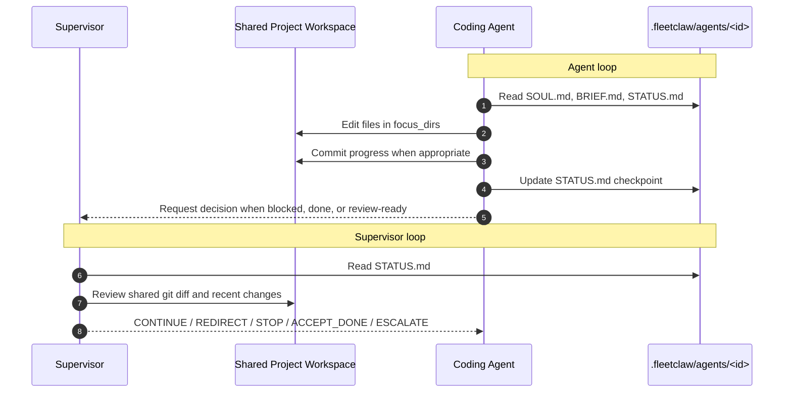

# FleetClaw

Multi-agent framework built on [OpenClaw](https://openclaw.ai). Deploys a supervisor + coding agents that iteratively build software with checkpoint-based coordination.

## How It Works

FleetClaw runs one supervisor and one or more coding agents against the same project workspace.



**Key points**

- Agents edit the real project files directly in the shared project root
- There are no per-agent git worktrees and no merge-back step
- Each agent keeps its instructions and checkpoint files in `.fleetclaw/agents/<id>/`
- The supervisor wakes on a schedule, reviews checkpoints plus git state, and sends the next decision

Heartbeat keeps agent sessions alive between checks, and supervisor cron jobs trigger regular review cycles.

## Quick Start

### 1. Add FleetClaw to your project

```bash
cp -r fleetclaw/ /path/to/your-project/fleetclaw/
cd /path/to/your-project/fleetclaw/
cp project-scope.example.yaml project-scope.yaml
```

### 2. Edit project-scope.yaml

Define your project, supervisor config, and coding agents with their tasks and focus directories.

### 3. Setup & Launch

```bash
./setup.sh    # Creates agent configs, OpenClaw profile, cron jobs
./launch.sh   # Starts gateway, enables heartbeat, seeds agent sessions
```

### 4. Monitor

- **OpenClaw UI**: http://localhost:{port}/ (port shown after launch)
- **FleetClaw Dashboard**: `cd dashboard && npm install && node server.js` → http://localhost:3333

## Architecture

```
your-project/
  fleetclaw/              # Framework (this repo)
    project-scope.yaml    # Your project config
    setup.sh              # Bootstrap everything
    launch.sh             # Start the fleet
    dashboard/            # Local monitoring UI
  .fleetclaw/             # Generated at setup (gitignored)
    agents/
      <agent-id>/         # Per-agent config files
        SOUL.md           # Agent personality & workflow
        BRIEF.md          # Task assignment
        STATUS.md         # Live checkpoint (agent updates this)
        PLAN.md           # Agent's implementation plan
        MEMORY.md         # Durable decisions & lessons
        memory/           # Daily logs
  src/                    # Your project code (agents work here)
```

## Agent Coordination

- **STATUS.md** is the checkpoint contract between agent and supervisor
- Agents update STATUS.md after each logical unit of work
- Supervisor reads STATUS.md + git diff to make decisions
- Decisions: `CONTINUE`, `REDIRECT`, `STOP`, `ACCEPT_DONE`, `ESCALATE`
- Heartbeat (2 min) keeps agents alive via the gateway — no timeout deaths
- Supervisor cron (configurable) runs periodic review cycles

## Scripts

| Script | Purpose |
|--------|---------|
| `setup.sh` | Parse scope, create agent dirs, generate OpenClaw config, cron jobs |
| `launch.sh` | Start gateway, install crons, enable heartbeat, seed sessions |
| `sync.sh` | Summarize shared-repo state; no merge step is needed in direct-workspace mode |
| `teardown.sh` | Disable heartbeat, remove crons, and clean generated files |

## Prerequisites

- [OpenClaw](https://openclaw.ai) CLI installed
- Node.js (for dashboard)
- Python 3 with PyYAML
- Git

## License

MIT
