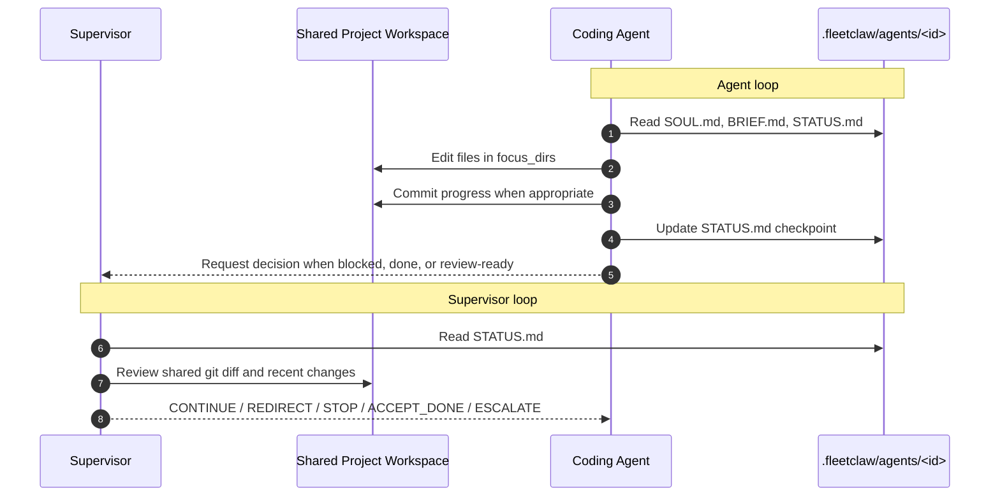

# FleetClaw

Multi-agent framework built on [OpenClaw](https://openclaw.ai). Deploys a supervisor + coding agents that iteratively build software with checkpoint-based coordination.

## How It Works

FleetClaw runs one supervisor and one or more coding agents against the same project workspace.



**Key points**

- Agents edit the real project files directly in the shared project root
- There are no per-agent git worktrees and no merge-back step
- Each agent keeps its instructions and checkpoint files in `.fleetclaw/agents/<id>/`
- The supervisor wakes on a schedule, reviews checkpoints plus git state, and sends the next decision

Heartbeat keeps agent sessions alive between checks, and supervisor cron jobs trigger regular review cycles.
FleetClaw also runs a small status reconciler that can normalize stale `STATUS.md` files after a recorded supervisor acceptance.

## Quick Start

### 1. Add FleetClaw to your project

```bash
cp -r fleetclaw/ /path/to/your-project/fleetclaw/
cd /path/to/your-project/fleetclaw/
cp project-scope.example.yaml project-scope.yaml
```

### 2. Edit project-scope.yaml

Define your project, supervisor config, and coding agents with their tasks and focus directories.
Keep settings in `project-scope.yaml`, and move long prose into normal files with `*_file` keys when you do not want to paste it inline.

```yaml
project:
  name: "my-project"
  repo: "."
  description_file: "prompts/project.md"
  review_url: "http://127.0.0.1:4173/"
  review_command: "cd apps/web && npm run dev:collector -- --host 127.0.0.1 --port 4173"
  design_review_command: "cd apps/web && npm run dev -- --host 127.0.0.1 --port 4174"

supervisor:
  objective_file: "prompts/supervisor-objective.md"
  handoff_rules_file: "prompts/handoff-rules.md"
  status_reconcile_interval_secs: 30

agents:
  - id: "frontend"
    task_file: "tasks/frontend.md"
    focus_dirs: ["apps/web/"]
```

Relative `*_file` paths resolve from the `fleetclaw/` directory.

### 3. Setup & Launch

```bash
./setup.sh    # Creates agent configs, OpenClaw profile, cron jobs
./launch.sh   # Starts gateway, dashboard, heartbeat, and agent sessions
```

### 4. Monitor

- **OpenClaw UI**: http://localhost:{port}/ (port shown after launch)
- **FleetClaw Dashboard**: starts automatically during `launch.sh` at http://localhost:{dashboard_port}
- The dashboard now shows both estimated Markdown read-set percentages and live session context usage percentages
- FleetClaw also starts a background status reconciler that watches recorded supervisor decisions and forces stale accepted checkpoints to `State: done`

## Authoring Model

FleetClaw now treats `project-scope.yaml` as the configuration source of truth.

- Keep project settings, models, cadence, and lane ownership in `project-scope.yaml`
- Declare the primary review surface with `project.review_url` / `project.review_command` when the accepted state depends on a specific runtime path
- Reference long-form prose with `project.description_file`, `supervisor.objective_file`, `supervisor.handoff_rules_file`, and `agents[].task_file`
- Override the built-in document templates with `advanced.template_dir` only if you need custom generated `SOUL.md` / `BRIEF.md` shapes
- Treat `.fleetclaw/agents/...` as generated runtime state, not setup-time authoring files

This means public users only need to maintain one config file plus any optional imported Markdown/text files they choose to reference.

If your project has both a mock/design mode and a live/integrated review mode, declare both in `project-scope.yaml`. FleetClaw will render the primary review surface into `PROJECT.md` and the supervisor prompt so acceptance decisions can target the right runtime.

## Architecture

```
your-project/
  fleetclaw/              # Framework (this repo)
    project-scope.yaml    # Your project config
    templates/            # Default templates for generated docs
    setup.sh              # Bootstrap everything
    launch.sh             # Start the fleet
    dashboard/            # Local monitoring UI
  .fleetclaw/             # Generated at setup (gitignored)
    agents/
      <agent-id>/         # Per-agent config files
        SOUL.md           # Agent personality & workflow
        BRIEF.md          # Task assignment
        STATUS.md         # Live checkpoint (agent updates this)
        PLAN.md           # Agent's implementation plan
        MEMORY.md         # Durable decisions & lessons
        memory/           # Daily logs
  src/                    # Your project code (agents work here)
```

## Agent Coordination

- **STATUS.md** is the checkpoint contract between agent and supervisor
- Agents update STATUS.md after each logical unit of work
- Supervisor reads STATUS.md + git diff to make decisions
- Decisions: `CONTINUE`, `REDIRECT`, `STOP`, `ACCEPT_DONE`, `ESCALATE`
- If the agent misses an `ACCEPT_DONE` update, FleetClaw reconciles the checkpoint from recorded session history instead of waiting forever
- Heartbeat (2 min) keeps agents alive via the gateway — no timeout deaths
- Supervisor cron (configurable) runs periodic review cycles

## Scripts

| Script | Purpose |
|--------|---------|
| `check-markdown-budget.sh` | Estimate the Markdown read-set load for supervisor/agents as a % of the context window |
| `check-context.sh` | Show live session token usage and context pressure from OpenClaw |
| `reconcile-status.sh` | Reconcile stale agent checkpoints from recorded supervisor decisions |
| `reconcile-loop.sh` | Background loop that runs `reconcile-status.sh` automatically after launch |
| `setup.sh` | Parse scope, create agent dirs, generate OpenClaw config, cron jobs |
| `launch.sh` | Start gateway, dashboard, install crons, enable heartbeat, seed sessions |
| `status-report.sh` | Print agent checkpoints, supervisor notes, markdown budget, and live context usage |
| `sync.sh` | Summarize shared-repo state; no merge step is needed in direct-workspace mode |
| `teardown.sh` | Stop dashboard, disable heartbeat, remove crons, and clean generated files |

## Prerequisites

- [OpenClaw](https://openclaw.ai) CLI installed
- Node.js (for dashboard)
- Python 3 with PyYAML
- Git

## License

MIT
